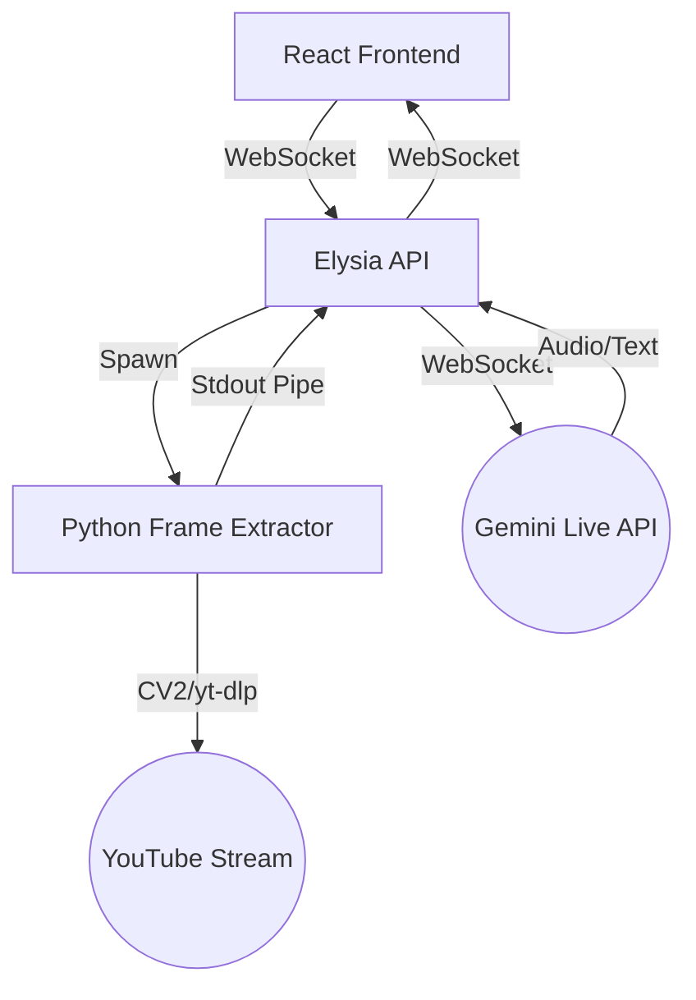

# OmniStream AI Architecture

## System Overview

OmniStream AI is a distributed multimodal system designed for sub-second latency video-to-audio commentary.

## Core Components

### 1. Frontend (`packages/web`)
- **Vite + React + Tailwind**: Modern, fast UI stack.
- **Custom PCM16 Player**: Low-level Web Audio API implementation for streaming raw audio chunks with minimal buffering.
- **WebSocket Manager**: Handles dynamic configuration and real-time data flow.

### 2. API Proxy (`packages/api`)
- **Elysia.js**: Ultra-fast Bun-native web framework.
- **Process Orchestrator**: Manages the lifecycle of the Python frame extractor.
- **Protocol Bridge**: Translates the custom frame extraction protocol into the Gemini Multimodal Live API format.

### 3. Frame Extractor (`python/src`)
- **OpenCV**: High-performance image processing.
- **yt-dlp**: Robust YouTube stream resolution.
- **Custom Protocol**: A binary-over-stdout protocol (Header: `FRME` + Length + JPEG) for zero-latency communication with the Node/Bun environment.

## Data Flow & Latency Optimization
- **FPS Control**: Frames are extracted at 1-2 FPS to balance context richness with token costs and processing overhead.
- **Direct Piped I/O**: We avoid temporary files or disk I/O, piping frames directly from the Python process to the Bun process via memory.
- **Native PCM16**: Gemini's audio is streamed in its rawest form to the browser for instant playback.
